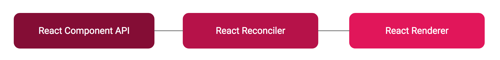

# 第一部分

这是文章的第一部分，我们来了解如何创建一个 React 自定义渲染器，以此作为分析 taro3 工作原理的逻辑起点。我们会使用 [`react-reconciler`](https://github.com/facebook/react/tree/master/packages/react-reconciler) 创建一个用于浏览器环境的自定义渲染器，即一个极简的 `react-dom`。

## React 是创建声明式 UI 框架的 LLVM

当我们初次使用 React 时，它是作为一个用于构建用户界面的 JavaScript 库被引入的。当你深入研究其内部原理后，很快便发现它不仅适用于 Web 应用，还适用于 iOS 和 Android 等。事实上，任何支持绘图的系统都可以作为 React 的渲染目标。我十分赞同将 React 称为创建声明式 UI 框架的 LLVM，它使得创建自己的声明式 UI 框架变得容易。



React 中有3个基本块。

1. React Component API：提供组件 API 和生命周期。
2. React Reconciler：它是核心 diff 算法，管理声明式 UI 背后的命令式更新。Reconciler 找出应用程序 UI 在不同状态之间的变化并在幕后应用这些变化。
3. React Renderer：渲染器不过是实现了一些 react-reconciler 所需要的函数。react-reconciler 将根据需要调用这些函数，以对最终目标更新变化。如果使用 DOM API 实现这些函数，则目标是 Web 应用。如果你使用 iOS UI Kit API 实现这些函数，目标是 iOS。如果使用 Android UI API 实现这些函数，则目标是 Android。

## React Reconciler

通过 `react-reconciler`，仅需要提供一个 `host config` 对象，就能编写一个自定义渲染器。

```javascript
const Reconciler = require('react-reconciler');

const HostConfig = {
  // 你在这里需要实现一些方法。
  // 以下有更多信息和示例。
};

const MyRenderer = Reconciler(HostConfig);

const RendererPublicAPI = {
  render(element, container, callback) {
    // 调用 MyRenderer.updateContainer() 来调度根节点的改变。
    // 参考 ReactDOM 或 React Native。
  }
};
```

`host config` 对象描述如何在目标环境（例如 DOM、canvas、控制台或任何你的渲染目标）中处理特定的操作。它看起来是这样的：

```javascript
const HostConfig = {
  createInstance(type, props) {
    // 例如，DOM 渲染器返回一个 DOM 节点
  },
  // ...
  appendChild(parent, child) {
    // 例如，DOM 渲染器将调用  .appendChild() 方法
  },
  // ...
};
```

## 用于浏览器环境的 React 自定义渲染器

现在让我们创建一个用于浏览器环境的 React 自定义渲染器，你可以把它理解为一个极简的 `react-dom`。

```typescript
const HostConfig = {
  createInstance(type) {
    const domElement = document.createElement(type);
    Object.keys(newProps).forEach(propName => {
      const propValue = newProps[propName];
      if (propName === 'children') {
        if (typeof propValue === 'string' || typeof propValue === 'number') {
          domElement.textContent = propValue;
        }
      } if (propName === 'className') {
        domElement.setAttribute('class', propValue);
      } else if (propName !== 'children') {
        const propValue = newProps[propName];
        domElement.setAttribute(propName, propValue);
      }
    });
    return domElement;
  },
  createTextInstance(text) {
    return document.createTextNode(text);
  },
  appendInitialChild(parent, child) {
    parent.appendChild(child);
  },
  appendChild(parent, child) {
    parent.appendChild(child);
  },
  removeChild(parent, child) {
    parent.removeChild(child);
  },
  commitTextUpdate(textInst, oldText, nextText) {
    textInst.nodeValue = newText;
  },
  clearContainer(container) {
    container.textContent = '';
  },
  supportsMutation: true
};

const ReactReconcilerInst = ReactReconciler(hostConfig);

const ReactDOMMini = {
  render: (reactElement, domElement, callback) => {
    if (!domElement._rootContainer) {
      domElement._rootContainer = ReactReconcilerInst.createContainer(domElement, false);
    }

    return ReactReconcilerInst.updateContainer(reactElement, domElement._rootContainer, null, callback);
  }
};
```

让我们分析一下我们的 `host config` 对象：

**`createInstance`**

这个方法根据 `type` 返回一个新创建的节点。

**`createTextInstance`**

与 `createInstance` 相同，但是用于文本节点。如果你的渲染器不支持文本节点，你可以在这里抛出异常。

**`appendInitialChild`**

这个方法作用于父实例，并将子对象添加到它的子对象列表中。它在树的构建阶段调用，此时虚拟节点树还没有渲染到屏幕上。

**`appendChild`**

与 `appendInitialChild` 相同，但是它在树的提交阶段调用。

**`removeChild`**

这个方法作用于父实例，从它的子对象列表中删除子对象。

**`commitTextUpdate`**

这个方法作用于文本实例，并将其文本内容更新为 `nextText`。这里的文本实例指的是由 `createTextInstance` 方法创建的节点。

**`clearContainer`**

这个方法作用于 `容器` 根节点，并删除它的所有子节点。

**`supportsMutation`**

`true` 为 **可变渲染器** 模式，像浏览器 DOM 拥有 `appendChild` 这种方法的宿主环境使用该模式。

我们在最后封装 `render` 方法，来暴露给用户使用。让我们看看这里发生了什么！

**`ReactReconcilerInst.createContainer`**

这个方法接受一个宿主环境的根容器，返回一个 React Reconciler 内部创建的对象（实际上是 FiberRoot 对象）。

**`ReactReconcilerInst.updateContainer`**

这个函数接收组件、上述 `createContainer` 方法的返回值、父组件、回调函数并触发一次从最顶层开始的更新。

## 验证

我们可以使用一个例子来验证一下我们自己创建的自定义渲染器！

使用 `create-react-app` 创建一个新的 React 项目：

```bash
npx create-react-app my-app
```

修改项目中 `src/index.js` 文件：

```diff
import React from 'react';
- import ReactDOM from 'react-dom';
+ import ReactDOMMini from './ReactDOMMini';
import './index.css';
import App from './App';

- ReactDOM.render(
+ ReactDOMMini.render(
  <React.StrictMode>
    <App />
  </React.StrictMode>,
  document.getElementById('root')
);
```

启动项目，如果你能看到页面被正常渲染，那么就证明我们编写自定义渲染器成功了！

具体的示例代码位于 [`examples/sample-custom-renderer-to-dom`](https://github.com/SyMind/how-taro3-work/tree/main/examples/sample-custom-renderer-to-dom) 目录中。

[跳转到 Part-II](./part-two.md)
